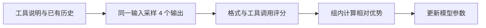

# ToolRL 学习笔记

ToolRL 适合作为理解“数据如何变成奖励，再如何驱动 GRPO 更新”的第一个项目。先读一条数据、算清一次奖励，再追训练流程，可以减少一开始被分布式训练框架淹没的情况。

阅读日期：2026 年 10 月 9 日。已下载[官方仓库](https://github.com/qiancheng0/ToolRL)，固定阅读版本为 `8cee13ec0ca72f0461da372a93a6fd8140dbb840`。本地目录：`repos/ToolRL/`；下方代码链接指向上游的固定版本，便于在 GitHub 上阅读。目前完成静态代码阅读和手写样例的奖励计算，尚未进行模型推理、训练或基准评估。

## 先理解它在训练什么

模型接收可用工具的描述、参数定义、用户问题和已有对话历史，生成下一步的工具调用或文本回答。默认奖励比较生成的调用与数据中的标注，关注输出结构、工具名称、参数名称和参数值。

例如，用户希望查询北京天气，标注调用可以写成下面这样。这是用于讲解的自建例子，不是原数据集样本：

```json
{"name": "get_weather", "parameters": {"city": "Beijing"}}
```

选择 `get_weather` 但填写 `Shanghai`，与选成 `get_time` 是不同层次的错误。ToolRL 的细分奖励为这种差别提供反馈。

默认训练链路可以概括为：



这是根据本地默认脚本和调用路径作出的概括。训练从静态数据中的历史出发生成下一步，不能直接理解为每个训练样本都在线执行完整的多轮工具任务。模型输出是在线采样的，历史和标注则来自数据。

## 数据先看这几个字段

已直接读取原始 JSON 并统计：

| 文件 | 实际条目数 | 用途 |
| --- | --- | --- |
| [rlla_rl.json](https://github.com/qiancheng0/ToolRL/blob/8cee13ec0ca72f0461da372a93a6fd8140dbb840/dataset/rlla_4k_raw/rlla_rl.json) | 4,000 | RL 的输入与评分标注 |
| [rlla_sft.json](https://github.com/qiancheng0/ToolRL/blob/8cee13ec0ca72f0461da372a93a6fd8140dbb840/dataset/rlla_4k_raw/rlla_sft.json) | 400 | SFT 样本 |

两者都有 `instruction`、`input`、`output`。预处理将前两项放入 system/user 消息，把 `output` 放到 `reward_model.ground_truth` 中。RL 不直接模仿这份输出，而是用它为模型生成结果评分。

4,000 条 RL 样本中，3,518 条的标注含 `<tool_call>`，391 条输入含 `<obs>`。后一个数字表示历史中带有观察记录，不代表本次训练会执行工具。

[预处理脚本](https://github.com/qiancheng0/ToolRL/blob/8cee13ec0ca72f0461da372a93a6fd8140dbb840/dataset/rlla_4k_raw/rlla.py)设置随机种子 `31415`，随机划出 2% 保存为 `test.parquet`；训练脚本将该文件用于验证。它与 BFCL、API-Bank 等独立评估不是同一层面的指标。本次未重新生成或核对已有 Parquet 的行数。

## 默认奖励如何计算

核心实现是 [rlla.py](https://github.com/qiancheng0/ToolRL/blob/8cee13ec0ca72f0461da372a93a6fd8140dbb840/verl/utils/reward_score/rlla.py) 中的 `compute_score`，第 257 行开始。默认所有奖励变体关闭时：

| 分项 | 代码行为 |
| --- | --- |
| 格式奖励 | 0 或 1；按标注所含字段检查标签顺序、换行与结构 |
| 工具正确性奖励 | 通常在 −3 到 3；依据工具名称、参数键和参数值匹配情况缩放 |
| 长度奖励 | 默认关闭，分数为 0 |
| 总分 | 三项相加；默认范围为 −3 到 4 |

对于上面的单工具、单参数例子，名称匹配、参数键匹配、参数值匹配各占一个原始得分单位；原始满分为 3，再线性映射到 −3 至 3。城市错误时前两项仍得分，因此正确性得分为 1，加格式分后总分为 2。

我已直接调用上游原函数，得到以下结果。输入全部是手写示例，不是模型生成结果：

| 示例 | 格式分 | 正确性分 | 总分 |
| --- | --- | --- | --- |
| 工具和参数完全正确 | 1 | 3 | 4 |
| 工具正确但城市错误 | 1 | 1 | 2 |
| 工具正确但缺少参数 | 1 | −1 | 0 |
| 选错工具 | 1 | −3 | −2 |
| 调用正确但缺少 think 标签 | 0 | 3 | 3 |
| 标签结构正确但 JSON 无效 | 1 | −3 | −2 |
| 需要工具却直接回答 | 0 | −3 | −3 |
| 标注为纯回答，但回答内容不同 | 1 | 0 | 1 |

这里有两个值得理解的边界：**格式错误不一定让工具正确性分归零**；对于不含工具调用的标注，代码直接将工具正确性分设为 0，**不会验证最终回答的事实正确性**。因此，训练奖励高不等于整体任务完成得好。

上述结果在 2026 年 10 月 9 日使用 Python 3.14.6 得到，评分步数为 0，奖励变体全部关闭。它们只用于理解评分规则，不是模型能力评估。

要重算这 8 个例子，在工作区根目录运行下面整段代码即可。只使用 Python 标准库，直接调用固定版本的上游函数，不需要安装训练环境，也不生成额外文件。

```bash
python3 - <<'PY'
import contextlib
import importlib.util
import io
import json
import os
import sys
from pathlib import Path

sys.dont_write_bytecode = True
for key in ("WITHLENGTH", "REFINEDREWARD", "COARSEREWARD", "STRICTMATCH",
            "CORRECTMAX1", "MAX1STEP30MAX3", "SCHEDULEREWARD",
            "SCHEDULELENGTH", "INTERMEDIATEREWARD"):
    os.environ[key] = "0"
os.environ["EXPERIMENT_NAME"] = "inspect-qwen-default-reward"
path = Path("repos/ToolRL/verl/utils/reward_score/rlla.py")
spec = importlib.util.spec_from_file_location("toolrl_reward", path)
reward = importlib.util.module_from_spec(spec)
spec.loader.exec_module(reward)

def tool_output(name="get_weather", parameters=None):
    if parameters is None:
        parameters = {"city": "Beijing"}
    call = json.dumps({"name": name, "parameters": parameters})
    return "<think>Query the requested city.</think>\n<tool_call>\n" + call + "\n</tool_call>"

target = tool_output()
response = "<think>Respond.</think>\n<response>Beijing</response>"
cases = [
    ("工具和参数完全正确", target, target),
    ("工具正确但城市错误", tool_output(parameters={"city": "Shanghai"}), target),
    ("工具正确但缺少参数", tool_output(parameters={}), target),
    ("选错工具", tool_output(name="get_time"), target),
    ("调用正确但缺少 think 标签", target.split("\n", 1)[1], target),
    ("格式标签正确但 JSON 无效", "<think>Query.</think>\n<tool_call>\nnot-json\n</tool_call>", target),
    ("需要调用工具却直接回答", response, target),
    ("纯回答目标但回答内容不同", response.replace("Beijing", "Shanghai"), response),
]
print("示例 | 格式 | 正确性 | 总分")
for label, prediction, ground_truth in cases:
    with contextlib.redirect_stdout(io.StringIO()):
        total, fmt, correct, length = reward.compute_score(prediction, ground_truth, step=0)
    print(f"{label} | {fmt:g} | {correct:g} | {total:g}")
PY
```

## GRPO 怎样利用这些分数

默认脚本对同一个输入采样 4 个输出。代码按输入分组，计算组内分数均值与标准差，把每个输出的分数转换为相对优势：高于组内平均值的输出通常获得正优势，低于平均值的输出获得负优势，随后进入裁剪后的策略优化目标。

需要联系代码理解三个问题：

1. **奖励在哪里？** `RewardManager` 将一次回答的任务评分放到最后一个有效回答 token 的位置。
2. **组怎样对应？** 训练器为原输入建立 `uid`，采样后重复数据，用 `uid` 找回同一输入的多个输出。
3. **为什么不是最高分样本直接做 SFT？** 更新使用采样概率、旧策略概率与相对优势；奖励通过策略梯度影响参数，而非把标注输出作为唯一模仿对象。

这里的描述以本地代码为依据。实际传入优势计算的分数还可能含 KL 惩罚，见下方配置差异。

## 推荐的代码阅读顺序

| 顺序 | 入口与关键位置 | 读完需要回答的问题 |
| --- | --- | --- |
| 1 | [数据预处理](https://github.com/qiancheng0/ToolRL/blob/8cee13ec0ca72f0461da372a93a6fd8140dbb840/dataset/rlla_4k_raw/rlla.py)，第 47 行 | prompt 和评分标注分别来自哪里？ |
| 2 | [奖励入口](https://github.com/qiancheng0/ToolRL/blob/8cee13ec0ca72f0461da372a93a6fd8140dbb840/verl/utils/reward_score/rlla.py)，第 257 行；匹配逻辑第 131 行 | 不同错误如何影响分数？ |
| 3 | [训练参数](https://github.com/qiancheng0/ToolRL/blob/8cee13ec0ca72f0461da372a93a6fd8140dbb840/examples/grpo_trainer/run_grpo.sh)，第 1 行 | 每批输入数、生成数、长度与学习率是什么？ |
| 4 | [RewardManager](https://github.com/qiancheng0/ToolRL/blob/8cee13ec0ca72f0461da372a93a6fd8140dbb840/verl/trainer/main_ppo.py)，第 39 行 | 文本分数怎样进入训练张量？ |
| 5 | [GRPO 优势计算](https://github.com/qiancheng0/ToolRL/blob/8cee13ec0ca72f0461da372a93a6fd8140dbb840/verl/trainer/ppo/core_algos.py)，第 111 行 | 组内归一化如何实现？ |
| 6 | [训练循环](https://github.com/qiancheng0/ToolRL/blob/8cee13ec0ca72f0461da372a93a6fd8140dbb840/verl/trainer/ppo/ray_trainer.py)，第 629 行 | 采样、评分、优势和参数更新如何串起来？ |
| 7 | [评估目录](https://github.com/qiancheng0/ToolRL/tree/8cee13ec0ca72f0461da372a93a6fd8140dbb840/benchmarks) | 如何在独立任务中验证能力？ |

第一轮重点读前五项即可，框架的分布式通信和显存管理可以在准备运行时再深入。

## 开始复现前要处理的事项

**模型初始化。** 论文比较了从 Instruct 模型直接做 GRPO，以及先追加 SFT 再做 GRPO。这里的 cold start 是没有额外的任务 SFT，并非从随机参数开始训练。因此，学习 SFT 可作为对照分支，不必把它当作运行 ToolRL 的前置步骤。[论文实验设置](https://arxiv.org/html/2504.13958v1#S4.S2)

**资源与依赖。** 论文附录报告每次训练使用 2 张 A100 80GB。上游 GRPO 脚本也默认使用两张 GPU、512 个输入、每输入 4 个生成、2048 的输入长度上限和 1024 的输出长度上限。这是原实验配置，不是已测定的最低硬件需求。[论文附录](https://arxiv.org/html/2504.13958v1#A2)；[本地训练脚本](https://github.com/qiancheng0/ToolRL/blob/8cee13ec0ca72f0461da372a93a6fd8140dbb840/examples/grpo_trainer/run_grpo.sh)

仓库安装示例使用 CUDA 版 PyTorch 2.4.0、vLLM 0.6.3、Ray 和 FlashAttention。准备训练时应建立独立环境，先核对设备与兼容性；不能直接将这套默认环境视为 CPU 或 MPS 方案。[上游 README](https://github.com/qiancheng0/ToolRL/blob/8cee13ec0ca72f0461da372a93a6fd8140dbb840/README.md)

**参数并非填完模型路径就结束。** [train_grpo.sh](https://github.com/qiancheng0/ToolRL/blob/8cee13ec0ca72f0461da372a93a6fd8140dbb840/train_grpo.sh)中的模型与实验名称仍是占位符。奖励解析器通过 `EXPERIMENT_NAME` 是否包含小写 `qwen` 或 `llama` 选择处理方式；随意命名可能触发异常。顶层脚本还会覆盖多个奖励开关，因此仅在外部先 `export` 开关可能不起作用。

**论文与默认代码的 KL 设置需要对齐。** 论文写明移除了 KL 惩罚，但当前脚本仍设置 `algorithm.kl_ctrl.kl_coef=0.001`。训练器在 `use_kl_loss=False` 时走 `apply_kl_penalty`，入口也创建了参考策略。静态检查表明“关闭 KL loss”不能解释为“没有任何 KL 惩罚”。复现前需明确采用论文设定还是仓库默认值，并在实际运行中检查配置与日志；本次没有修改上游实现。[论文方法](https://arxiv.org/html/2504.13958v1#S3.S4)；[训练器](https://github.com/qiancheng0/ToolRL/blob/8cee13ec0ca72f0461da372a93a6fd8140dbb840/verl/trainer/ppo/ray_trainer.py)

**评估仍需适配。** API-Bank 脚本含输出路径占位符，BFCL 目录提供模型适配代码，Bamboogle 脚本涉及外部服务。训练验证分数、工具调用匹配率与完整任务成功率要分别记录，不能直接互换。

## 我的设备与复现安排

2026 年 10 月 9 日检查的本机配置为 MacBook Pro、Apple M4、24 GB 统一内存。

| 要做的事 | 当前安排 |
| --- | --- |
| 读代码、处理数据、计算奖励 | 在本机完成；上面的奖励示例已验证 |
| 小模型生成工具调用 | 可尝试通过 MLX 运行 1.5B 或 3B 量化模型，尚未进行本机验证 |
| 官方 GRPO 或 PPO 训练 | 使用远程 Linux 和 NVIDIA GPU；当前 CUDA 训练环境不能直接在 Mac GPU 上运行 |
| 估算完整复现费用 | 先短时试跑，测每步耗时和显存，再按 GPU 数量 × 小时单价 × 占用时长计算 |

本机推理需要适配 Apple 芯片的运行方式；不能把量化推理或 LoRA 练习视为已经复现官方训练。[MLX 说明](https://github.com/ml-explore/mlx-lm)；[vLLM 0.6.3 环境要求](https://docs.vllm.ai/en/v0.6.3/getting_started/installation.html)

## 当前进度与下一步

- 已完成：官方代码下载与版本记录，数据字段和条目数检查，默认奖励、GRPO 主调用路径与评估入口阅读。
- 已执行：8 个手写样例直接调用上游奖励函数，代码与结果统一记录在本文中。
- 未执行：模型下载、生成推理、训练、BFCL/API-Bank/Bamboogle 评估。

下一次从一条 RL 样本入手，依次解释工具描述、历史、标注和奖励；随后用一组候选输出手算相对优势。准备训练时，再根据实际可用的 GPU 与预算决定模型规模和验证配置。
